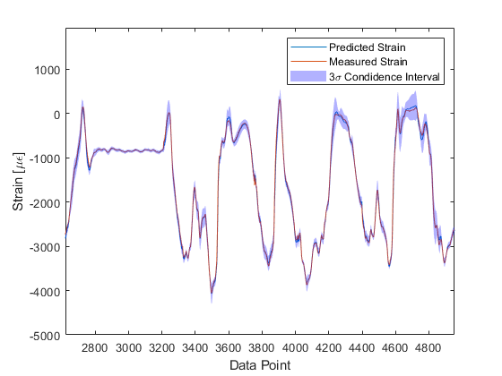
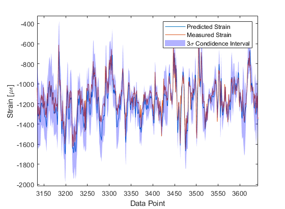
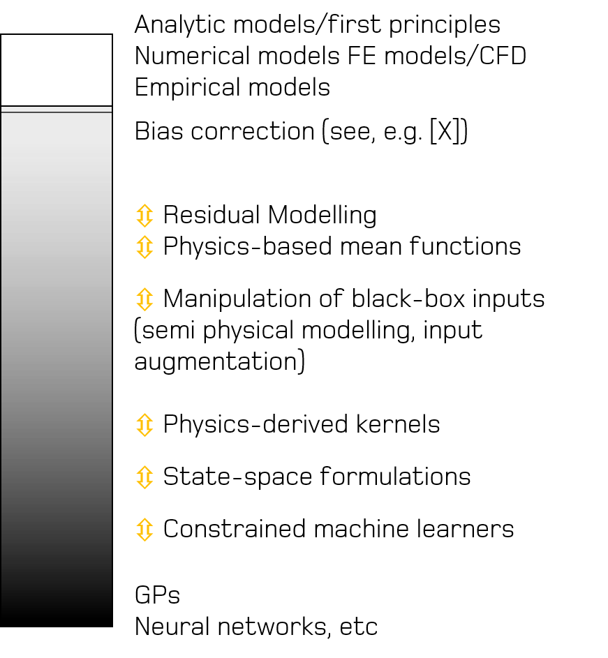

In the Dynamics Research Group, our research interests span all things structural dynamics related. One particular interest is the development of models that can infer the health state of a structure and predict its remaining useful life, often achieved through the use of machine learning tools. The potential benefits are vast, including the possibility of informed maintenance scheduling and automated decision making. 

A barrier to the development of these models however is the complex dynamic environment in which these structures often live, with environmental and operating conditions regularly varying. For example, the loading that an aircraft wing is subject to will depend upon the exact flight phase that the aircraft is in (e.g. taxiing to the runway, or at cruising altitude), each containing different types of manoeuvres. Ambient temperature and pressure will also be dependent on many factors, such as the local climate and particular altitude. All of these factors will then influence the dynamic behaviour of the wing. To compensate for these effects, data used to train any predictive model must be representative of the full environmental and operational envelope, which in many applications, is impractical to collect. Where models have not been learnt on suitably informative training data, then there is no guarantee that the model will be able to make accurate predictions. To illustrate this behaviour, let's take a look at a data-driven model tasked with predicting bending strain on an aircraft wing during different manoeuvres to inform an in-service fatigue assessment. The data set comprises of 84 flights, five of which are used for model training. The train model is able to generalise well with a very low prediction error for the majority of the flight, which we can see on a typical strain predictions for a flight not included in the training set.

If we move to look at strain predictions made during conditions that were atypical of normal flight behaviour - a low altitude sortie, characterised by a very turbulent response - the model is unable to predict strain as accurately as in the previous instance. 

This is because the conditions observed are different to those that were included in the training set (out-of-sample scenarios), with the data-driven model being unable to generalise.

<!--- the loading that a bridge is subject to will depend upon traffic levels, whilst ambient temperature will continually vary. All of these factors will influence the dynamic behaviour of the bridge. To compensate for these effects, data used to train any predictive model must be representative of the full operational and environmental envelope, which in many applications, is impractical to collect. Where models have not been learnt on suitable training data, the inherent flexibility of black-box learners results in there being no guarantee that any predictions made are physically consistent. 

-->

In an attempt to mitigate some of these problems, a package of work is currently being led within the group by Prof. Lizzy Cross on the use of physics-informed machine learning. The aim here is to bring together the flexibility and power of state-of-the-art machine learning techniques with more structure and insightful physics-based models that can be derived from domain expertise. By combining monitoring data with engineering insight, the objective is to develop models that can learn underlying statistical relationships, but can fall back to governing physical principles. 

To explore the currently available modelling approaches, it is helpful to consider physics-informed (grey-box) models to be on a spectrum between purely physics-based methods (white-box) and purely data-driven learners (black-box). Publications by the group corresponding to each of these different types of grey-box architecture for structural dynamics are included Here.

At the ``whiter" end of the spectrum are models built from governing physical equations. For example, <strong> finite element models </strong>, where differential equations that describe the phenomena of interest are numerically solved. Modelling approaches where data are used for </strong>model selection</strong> and parameter estimation fall nearby. <strong>Residual models</strong> are those that use a data-driven approach to account for the observed difference between a physical models and observed measurements, with the general form

where $f(x)$ is the output of the physical model, $\delta(x)$ is the model discrepancy and $\epsilon$ the noise process. The discrepancy term is
often used to correct a misspecified physical model, giving rise to the term ``bias
correction". In some of our recent work, we have considered residual modelling in the context of compensating for uncaptured/missing behaviours in a physics-based model, which is discussed further in papers under Combining physics-based and machine learning models. 

As we progress further along the spectrum of white to black, semi-physical modelling considers the case where features used in a data-driven learner are subject to some transformation before being fed into the model as inputs, and can also be thought of as input augmentation. Examples of grey-box modelling following this architecture can be found under Manipulation of black-box inputs. 

When considering kernel-based machine learning methods such as Gaussian processes and supper-vector machines, a function that defines how similarity between data points should be measured needs to be specified. More formally, this function is defined as the kernel. We can look to encode physical insight into the form of these functions to develop <strong>physics-derived kernels</strong>, ensuring that the functions drawn from the kernel have physically-relevant structure. Papers related to this topic can be found Here. 

At the black end of the spectrum exists <strong>constrained machine learners</strong>. These methods constrain a machine learner with some physically-derived assumptions or laws that the predictions of the model are guaranteed to satisfy. These types of grey-box models are discussed Here.  

<!---
 Of particular interest is structural health monitoring (SHM), where the objective is to develop condition-based monitoring systems that assess the health of structure. For example, from some measured sensor data of a turbine blade, can I automatically detect the formation of damage and predict the remaining useful life. These are just two examples of tasks that lie within the remit of SHM, with other notable tasks including damage localisation and quantification. These tasks can be conveniently grouped into a hierarchy, where each ``level" becomes increasingly difficult.

 consistently vary on multiple timescales. 

 system ID

### Combining physics-based and machine learning models

### Manipulation of black-box inputs

### Physics-derived kernels

### Constrained machine learners

-->